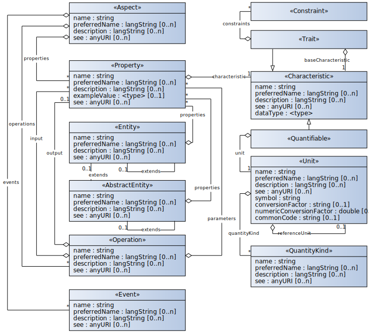

# Semantic Aspect Meta Model (SAMM)


- [Introduction](#introduction)
- [Example Usage](#example-usage)
- [SAMM Versioning](#samm-versioning)
- [Getting help](#getting-help)
- [Build and contribute](#build-and-contribute)

## Introduction
The Semantic Aspect Meta Model (SAMM) allows the creation of models to describe the semantics of
digital twins by defining their domain specific aspects. In this context, digital twins are the
digital representation of a physical or virtual object that bundles and combines several aspects.
SAMM provides a set of predefined objects (as depicted below) that allow a domain expert to define
aspect models and complement a digital twin with a semantic foundation.

SAMM was previously known as BAMM (BAMM Aspect Meta Model).

This repository contains the detailed documentation of the SAMM specification as an
[Antora](https://antora.org/) module, as well the formal specification parts as
[SHACL](https://www.w3.org/TR/shacl/) shapes.

The source files (AsciiDoc) are built using Maven and
[Antora](https://antora.org/), which generates the documentation as HTML files.



## Example Usage
SAMM standardizes the creation of domain specific aspect models and also makes them reusable.
Therefore, the created aspects can be used in several different digital twins.

Imagine an automated guided vehicle (AGV) and its digital representation.
The AGV digital twin could encompass aspects, such as its movement position or battery state.
However, both aspects could also be part of other digital twins.
This modularization and reusability simplifies the creation of highly complex use cases.

## SAMM Versioning

SAMM and its SDKs evolve over time. While measures are taken to do this in a non-breaking manner,
some changes cannot be carried out without the need to define a new, breaking version.

SAMM uses semantic versioning (`major.minor.micro`) with the following rules:

* The `major` part designates major changes in the meta model and can imply
  breaking changes
* A non-breaking change in the meta model or a change to the model elements that are
  part of SAMM (`samm-c` and `samm-e`) increases the `minor` part
* Changes to existing features or bugfixes increase the `minor` part

## Getting help
Are you having trouble with Semantic Aspect Meta Model? We want to help!

* Check the reference [documentation](https://eclipse-esmf.github.io/samm-specification/snapshot/index.html).
* Ask a question the [community forum](https://www.eclipse.org/forums/index.php/f/617/).
* Having issues with SAMM? Open a [GitHub issue]( https://github.com/eclipse-esmf/esmf-semantic-aspect-meta-model/issues).

## Build and contribute

### Build the documentation
To build the Antora documentation locally, clone the repository and run

```sh
./mvnw generate-resources -pl documentation -Pantora
```

inside the repository folder.

Navigate to *build* > *site* and open the `index.html` page in your web browser to see the result.
Repeat the steps everytime you make any changes in the documentation and want to inspect the final outcome.

### Build the SAMM artifact
To build the Semantic Aspect Meta Model Java artifact, run

```sh
./mvnw clean install -pl esmf-samm-build-plugin
./mvnw clean package -pl esmf-semantic-aspect-meta-model
```

This will compile the code and run all tests. The resulting JAR file can be found under
esmf-semantic-aspect-meta-model > target. Please be aware, that you need JDK 11 to run build and
tests.

Before making a contribution, please take a look at the [contribution guidelines](CONTRIBUTING.md).
Please keep in mind to create an issue first before opening a pull request.
