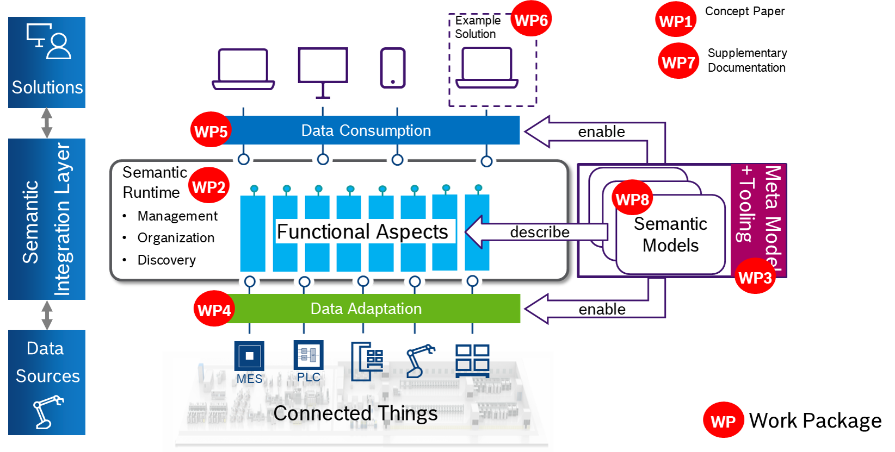

# BAMM Aspect Meta Model - Specification

- [Introduction](#introduction)
- [Application](#application)
- [Build and contribute](#build-and-contribute)

## Introduction
BAMM allows the creation of models to describe the semantics of digital twins by defining their domain specific aspects.
In this context, digital twins are the digital representation of a physical or virtual object that bundles and combines several aspects.
The aspect meta model (BAMM) allows to define aspect models and complement a digital twin with a semantic foundation.

This repository contains the detailed documentation of the BAMM specification as an AsciiDoc documentation.
The source files are built using gradle and [Antora](https://antora.org/).

To find out more about BAMM please visit the current version of the [documentation website]().

Within the OMP semantic data structuring (SDS) working group, the BAMM specification addresses work package 3, as depicted below.

## Application
BAMM standardizes the creation of domain specific models and also makes them reusable.
Therefore, the created aspects can be used in several different digital twins.

Imagine an automated guided vehicle (AGV) and its digital representation.
The AGV digital twin could encompass aspects, such as its movement position or battery state (for more on this example please read our [white paper]()).
However, both aspects could also be part of other digital twins.
This modularization and reusabaility simplifies the creation of highly complex use cases.

## Build and contribute
To build the Antora documentation locally, clone the repository and run `gradle build antora` inside the repository folder.
Navigate to *build* > *site* and open the `index.html` page in your web browser to see the result.
Repeat the steps everytime you make any changes in the documentation and want to inspect the final outcome.

Before making a contribution, please take a look at the [contribution guidelines](CONTRIBUTING.md).
Please keep in mind to create an issue first before opening a pull request.