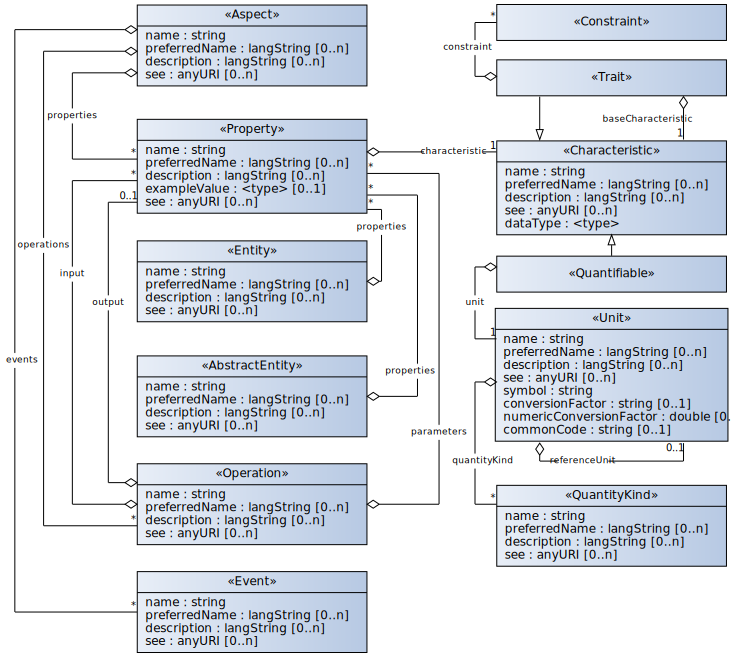

# BAMM Aspect Meta Model 

- [Introduction](#introduction)
- [Example Usage](#example-usage)
- [Getting help](#getting-help)
- [Build and contribute](#build-and-contribute)

## Introduction
The [BAMM Aspect Meta Model](https://openmanufacturingplatform.github.io/sds-bamm-aspect-meta-model/bamm-specification/snapshot/index.html) (BAMM) allows the creation of models to describe the semantics of digital twins by defining their domain specific aspects.
In this context, digital twins are the digital representation of a physical or virtual object that bundles and combines several aspects.
The BAMM Aspect *Meta* Model (BAMM) provides a set of predefined objects (as depicted below) that allow a domain expert to define aspect models and complement a digital twin with a semantic foundation.

This repository contains the detailed documentation of the BAMM specification as an AsciiDoc documentation.
The source files (AsciiDoc) are built using [Gradle](https://gradle.org/) and [Antora](https://antora.org/), which generates the documentation as HTML files.



## Example Usage
BAMM standardizes the creation of domain specific aspect models and also makes them reusable.
Therefore, the created aspects can be used in several different digital twins.

Imagine an automated guided vehicle (AGV) and its digital representation.
The AGV digital twin could encompass aspects, such as its movement position or battery state.
However, both aspects could also be part of other digital twins.
This modularization and reusabaility simplifies the creation of highly complex use cases.

## Getting help
Are you having trouble with BAMM Aspect Meta Model? We want to help!

* Check the reference [documentation](https://openmanufacturingplatform.github.io/sds-bamm-aspect-meta-model/bamm-specification/snapshot/index.html)
* Having issues with BAMM? Open a [GitHub issue]( https://github.com/OpenManufacturingPlatform/sds-bamm-aspect-meta-model/issues).

## Build and contribute
To build the Antora documentation locally, clone the repository and run

```./gradlew antora```

inside the repository folder.

Navigate to *build* > *site* and open the `index.html` page in your web browser to see the result.
Repeat the steps everytime you make any changes in the documentation and want to inspect the final outcome.

Before making a contribution, please take a look at the [contribution guidelines](CONTRIBUTING.md).
Please keep in mind to create an issue first before opening a pull request.